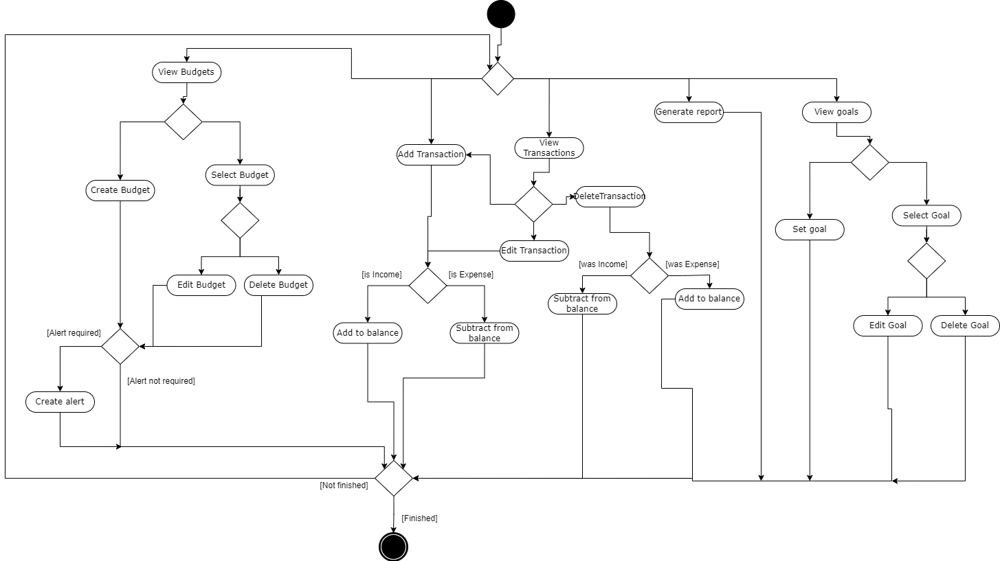
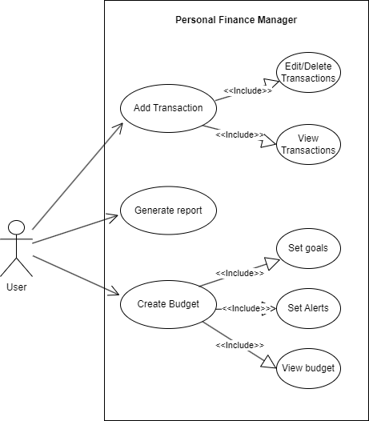
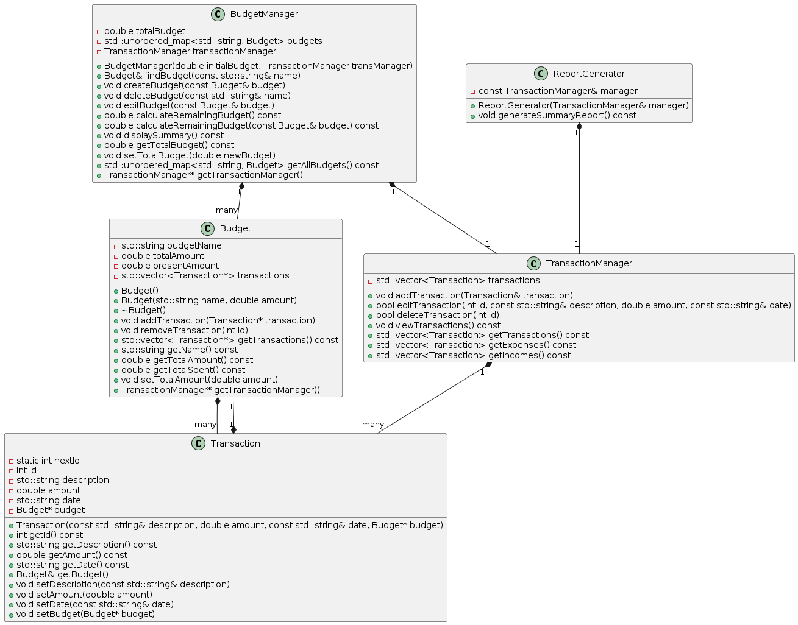

# Personal Finance Manager

Team name: Kolegos. 

Members: Ridas Kožukauskas, Gustas Griežė.

The Personal Finance Manager is an interactive application designed for managing and monitoring one's financial situation. This application allows users to manage their income and expenses, create and track budgets, and monitor financial goals.

## Project Architecture

### Primary Components:
- **User Interface (UI):**
  - Serves as the front-end for user interactions.
  - Handles input such as transaction entries, budget creation, and goal setting.

- **Transaction Manager:**
  - Manages adding, viewing, editing, and deleting of transactions.

- **Budget Manager:**
  - Handles the creation, viewing, editing, and deletion of budgets.
  - Tracks and compares budget against actual spending.

- **Goal Manager:**
  - Facilitates the setting, viewing, editing, and deletion of financial goals.
  - Monitors progress towards financial goals.

- **Alert System:**
  - Generates and displays alerts for budget limits or goal achievements.

- **Data Processing Engine:**
  - Processes input data, computes balances, and updates financial goals.

### Data Flow:
- Data is entered by users through the UI and directed to the appropriate managers.
- Managers update the system's state with the new data.
- Outputs such as updated balances, budgets, and goals are sent to the UI for display.
- Alerts are triggered and displayed based on specific system state changes.

### Input/Output:
- **Input:** 
  - Transactions data, budget details, and goal parameters entered by the user.
- **Output:** 
  - Transaction history, budget summaries, goal progress, and alerts displayed to the user.

### Storage:
- Utilizes a robust database system for secure data storage.
- Ensures data persistence for transaction histories, budget records, and financial goals.
- Allows historical data analysis and feature expansions such as reporting.

## Activity diagram

## Use-case diagram

## Class diagram

## Technologies & architecture
### Version Control
- **Git**: Essential for source code management. Host your repository on platforms like GitHub, GitLab, or Bitbucket.

### Documentation Tool
- **Doxygen**: For generating documentation from annotated C++ sources.

### Documentation
[Open the PDF file](./PersonalFinanceManager.pdf)

## Workload report
| Name Surname  | Grade assesment amount  |
|---|---|
| Ridas Kožukauskas  |  50%  |
| Gustas Griežė |  50% |
